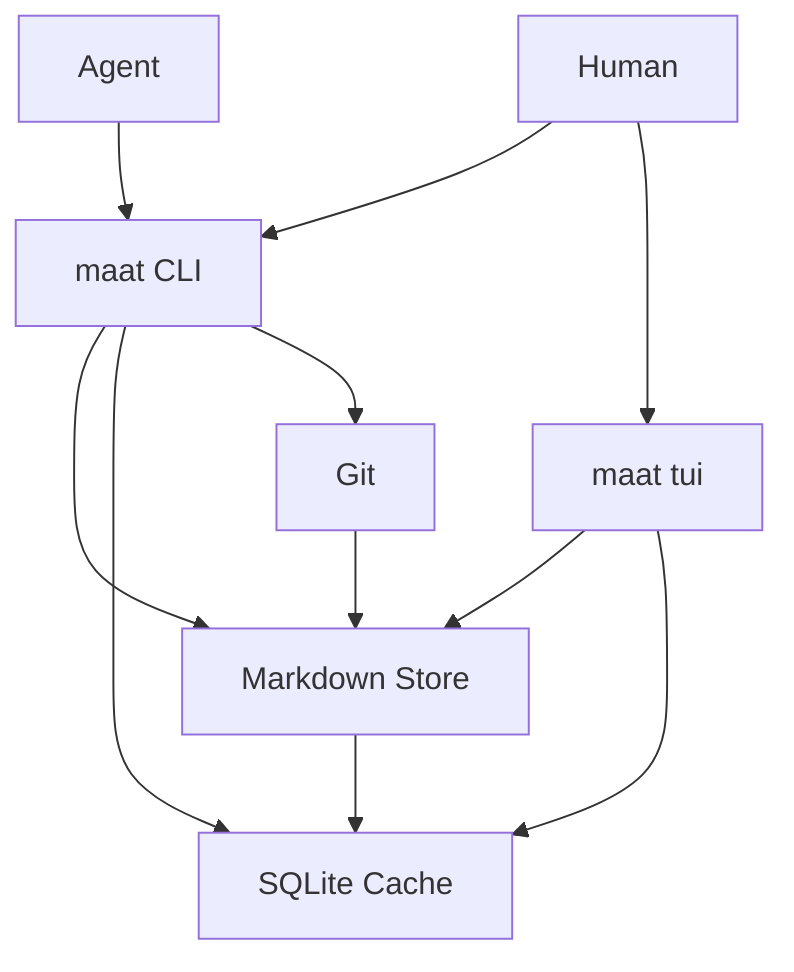

# Architecture

Maat is an installable project memory for agent-managed work.

It has one durable source of truth and two local interfaces around it:

- Git plus Markdown is the source of truth.
- SQLite is a rebuildable local search cache.
- The `maat` binary provides CLI commands for agents and humans.
- The Bubble Tea TUI provides a terminal dashboard.

## Goals

- Agents can create, claim, comment on, and complete work without human curation.
- Humans can query state from the terminal or TUI.
- Every machine can rebuild local state from the Git-controlled Markdown store.
- Multiple agents can write concurrently with minimal merge conflicts.
- Search works across projects, goals, tickets, and events.

## Non-Goals

- Maat is not a hosted service.
- Maat is not a replacement for the project source repositories.
- SQLite is never authoritative.
- Agents should use the CLI instead of hand-editing Markdown.

## System Shape



## Storage Repo

The storage repo is a normal Git repository containing Markdown object files:

```text
/Users/casprine/maat-state
~/maat-state
~/work/personal-control-plane
```

A machine links to that repo during setup:

```sh
maat setup --storage /absolute/path/to/maat-state
```

The storage repo should be separate from the Maat product source repo.

## Local Config

Local config records machine-specific settings only:

- storage repository path
- default actor
- auto-pull before reads
- auto-commit after writes
- auto-push after commits

Local config is not project state.

## SQLite Cache

SQLite stores local indexes for search and fast reads. It can be deleted and rebuilt at any time:

```sh
maat index rebuild
```

If a write succeeds but the index rebuild fails, the Markdown write is still durable. Agents should rebuild the index later instead of retrying the same write.

## Conflict Prevention

High-frequency writes create new files instead of editing shared files:

- create goal: new goal file plus event file
- create ticket: new ticket file plus event file
- comment: new event file
- claim ticket: new event file
- complete ticket: new event file

Generated summaries, dashboards, status views, and activity feeds are rebuildable views unless explicitly committed.

## Write Flow

Write commands follow this shape:

1. Read the configured storage repo.
2. Pull if configured.
3. Write Markdown object or event files.
4. Validate the store.
5. Refresh local indexes.
6. Commit storage changes if configured.
7. Push if configured.

See [Storage Model](./storage-model.md), [Schema](./schema.md), and [Agent Protocol](./agent-protocol.md).
