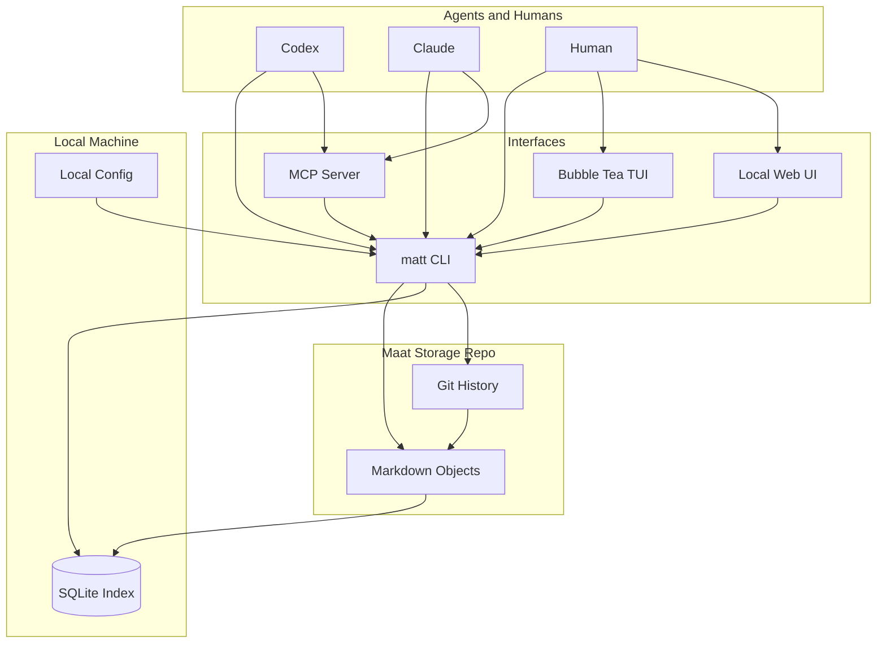

# Architecture

Maat is an installable project memory for agent-managed work.

The product has one durable source of truth and several disposable interfaces around it:

- Git plus Markdown is the source of truth.
- SQLite is the local query and search index.
- The `matt` binary provides CLI commands for agents and humans.
- A Bubble Tea TUI provides an interactive terminal dashboard.
- A local web UI provides a browsable dashboard.
- Future MCP tools expose the same operations to agent systems.

## Design Goals

- Agents can create, update, claim, comment on, and complete work without human curation.
- Humans can query state from the terminal or a UI.
- Every machine can rebuild local state from the Git-controlled Markdown store.
- Multiple agents can write concurrently with minimal merge conflicts.
- Search works across projects, goals, tickets, comments, decisions, reports, and history.
- The system remains useful even when the UI, index, or adapters are deleted.

## Non-Goals

- Maat is not a hosted SaaS product by default.
- Maat is not a replacement for the project source repositories.
- Maat does not make SQLite authoritative.
- Maat does not require agents to hand-edit Markdown once the CLI/MCP layer exists.
- Maat does not try to mirror all of GitHub Issues, Linear, or Jira.

## System Shape



## Durable Store

The durable store is a normal Git repository containing Markdown files.

The store can live anywhere:

```text
/Users/casprine/maat-state
/Users/casprine/Desktop/vendor/sunday-studio/maat
~/work/personal-control-plane
```

The user links the binary to that store during setup:

```sh
matt init
matt storage link /absolute/path/to/maat-state
```

If the storage repo is cloned on a new machine, the user can run:

```sh
matt index rebuild
```

and recover the fast local view.

## Local Config

Local config records machine-specific settings only:

- storage repository path
- default Git remote
- UI port
- index database path
- preferred editor
- agent identity defaults

Local config is not authoritative project state.

## SQLite Index

SQLite is a rebuildable local cache.

It stores parsed objects, materialized current state, keyword search tables, vector embeddings, and UI query helpers. The index may be deleted at any time and rebuilt from Markdown.

See [Search And Indexing](./search-index.md).

## Interfaces

### CLI

The CLI is the primary write interface and the interface agents should prefer.

Examples:

```sh
matt status
matt project link
matt goal create orion "Ship first deploy"
matt ticket create orion --goal G-20260525-190533-a7f3 "Verify install"
matt ticket claim T-20260525-190700-b91c --ttl 2h
matt ticket comment T-20260525-190700-b91c "Found failing deploy path."
matt ticket complete T-20260525-190700-b91c --evidence "installer smoke passed"
matt search "agent health"
matt sync
```

### TUI

The TUI is built with Charmbracelet Bubble Tea, Bubbles, and Lip Gloss.

It should feel like a fast operational dashboard:

- project picker
- active tickets
- blocked tickets
- timeline
- search
- agent activity
- sync/index status

See [CLI, TUI, And UI](./cli-tui-ui.md).

### Web UI

The web UI is a local dashboard launched by:

```sh
matt ui
```

It reads from the same core library and SQLite index as the CLI. It should not invent a separate write path.

### MCP

MCP is a future adapter for agents. It should expose typed tools that map to the same core operations as the CLI.

## Conflict Prevention

Maat should prevent conflicts by design.

High-frequency writes should create new files instead of appending to shared files or editing shared summaries.

Examples:

- create ticket: new ticket file
- comment: new event file
- claim ticket: new claim event
- complete ticket: new status event
- record decision: new decision file plus event file

Monthly ledgers, project summaries, dashboards, and status reports should be generated views unless a human explicitly asks to commit a snapshot.

See [Storage Model](./storage-model.md).

## Sync Flow

Every write command should use this logical flow:

1. Inspect the configured storage repo.
2. Pull/rebase if configured to do so.
3. Create one or more small Markdown files.
4. Validate the store.
5. Rebuild or incrementally update the SQLite index.
6. Commit the storage changes.
7. Push if configured.

If Git conflicts still occur, Maat should preserve data and explain the conflict in object terms, not raw file terms.

## Repository Linking

Maat tracks source repositories as project context.

From inside a source repo:

```sh
matt project link
```

Maat should detect:

- absolute path
- Git remote URL
- current branch
- repository root
- project name candidate

Project identity should not break when a source repo moves. The stable project key should use persisted metadata, not only the current filesystem path.

## Product Boundary

Maat tracks the work and the history of work.

It does not own the source code, replace GitHub, or replace the individual project repositories. It points to those repositories, records work against them, and lets agents coordinate around durable state.
