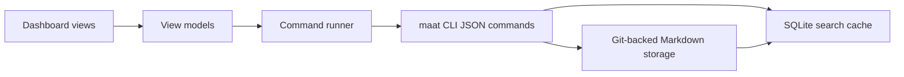

# Desktop Dashboard Views

This document defines the read-only dashboard views for the Tauri macOS app
introduced in [macOS App Architecture](macos-app-architecture.md). The desktop
dashboard is a thin UI over the `maat` CLI. It must not parse Markdown directly,
write files, or bypass the CLI command runner.

Markdown plus Git remains the source of truth, SQLite remains a rebuildable
search cache, and CLI JSON is the product API for the desktop app.

## Goals

- Load dashboard data from existing `maat` JSON commands.
- Keep view models separate from CLI response DTOs.
- Provide predictable refresh, loading, empty, and error behavior.
- Make the first dashboard release read-only while preserving a path to later
  write actions through explicit CLI commands.

## Non-Goals

- No direct Markdown editing from the desktop UI.
- No app-owned state database for projects, goals, tickets, events, catalog, or
  search results.
- No desktop-only write paths.
- No hidden background completion, claiming, commenting, syncing, or committing
  from dashboard navigation.

## Read-Only System Shape



The dashboard code should have three boundaries:

| Boundary | Owns | Must not own |
| --- | --- | --- |
| Command runner | Process execution, stdout/stderr capture, JSON parsing, exit status, cancellation, timeout, command allowlist. | UI layout, derived display labels, business decisions beyond command safety. |
| CLI DTO layer | Type definitions that mirror JSON output from `maat`. | Derived UI state, local mutations, fallback Markdown parsing. |
| View model layer | Sorting, grouping, selection, stale/loading/error flags, empty states, display summaries. | Shell execution, file access, writes, storage validation logic. |

The frontend should treat all CLI DTOs as immutable snapshots. Any transformation
into counts, filters, labels, badges, or selected objects belongs in the view
model layer and can be discarded on refresh.

## Command Runner Contract

Every dashboard data load goes through one command runner API. A suitable shape
is:

```ts
type CommandName =
  | "status"
  | "projects"
  | "project.show"
  | "ticket.list"
  | "ticket.show"
  | "catalog.list"
  | "catalog.show"
  | "search";

type CommandResult<T> =
  | { ok: true; command: CommandName; data: T; stderr?: string; durationMs: number }
  | { ok: false; command: CommandName; error: CommandError; stderr?: string; durationMs: number };

type CommandError = {
  kind: "missing-cli" | "not-setup" | "storage" | "json" | "exit" | "timeout" | "cancelled";
  message: string;
  exitCode?: number;
  remediation?: string;
};
```

The runner must:

- Resolve the configured `maat` binary path through the CLI manager.
- Pass `--json` for every dashboard command.
- Add `--storage <path>` when the app has an explicit storage path.
- Parse stdout as JSON only after the process exits successfully.
- Preserve stderr and exit code for error states.
- Use request IDs so stale responses cannot overwrite newer view model state.
- Apply a dashboard read allowlist and reject all commands outside it.

The read allowlist is:

| View need | CLI command |
| --- | --- |
| Dashboard totals | `maat status --json` |
| Project list | `maat projects --json` |
| Project detail | `maat project show <project-key> --json` |
| Project tickets | `maat ticket list --project <project-key> --json` |
| Ticket detail | `maat ticket show <ticket-id> --project <project-key> --json` |
| Catalog overview | `maat catalog list --project <project-key> --json` |
| Catalog collection | `maat catalog list <apps|patterns|decisions|opportunities> --project <project-key> --json` |
| Catalog object detail | `maat catalog show <id-or-slug> --project <project-key> --json` |
| Search | `maat search <query> --json` |

The runner should not expose write commands to the read-only dashboard module.
Commands such as `goal create`, `ticket create`, `ticket claim`, `ticket
comment`, `ticket complete`, `sync --push`, and `setup doctor --fix` belong to
separate write or setup modules.

## CLI DTOs

The DTO types should mirror the current CLI JSON fields and stay close to the Go
types that produce them.

### Status

`maat status --json` returns:

```ts
type StatusSummaryDTO = {
  projects: number;
  goals: number;
  active_goals: number;
  done_goals: number;
  tickets: number;
  open_tickets: number;
  done_tickets: number;
  blocked_items: number;
  decision_items: number;
};
```

### Projects

`maat projects --json` returns an array:

```ts
type ProjectListItemDTO = {
  id: string;
  key: string;
  title: string;
  status: string;
  updated?: string;
  path: string;
  layout: "object" | string;
};
```

`maat project show <project-key> --json` returns an object project snapshot:

```ts
type ObjectProjectDTO = {
  key: string;
  display_name: string;
  status: string;
  created: string;
  updated: string;
  tags?: string[];
  summary?: string;
  identity?: Record<string, string>;
  path: string;
  goals?: ObjectGoalDTO[];
  tickets?: ObjectTicketDTO[];
  events?: ObjectEventDTO[];
  catalog?: CatalogDTO;
};
```

### Tickets

`maat ticket list --project <project-key> --json` returns compact ticket views:

```ts
type TicketViewDTO = {
  id: string;
  project_key: string;
  goal_id?: string;
  title: string;
  status: string;
  description?: string;
  acceptance?: string[];
  created?: string;
  path?: string;
};
```

`maat ticket show <ticket-id> --project <project-key> --json` returns the same
shape for one ticket. The dashboard should call `ticket show` for a detail pane
even when the selected ticket already appears in `project show`; this keeps the
detail boundary aligned with the CLI API and allows future ticket detail fields
to appear without changing project loading.

### Catalog

`maat catalog list --project <project-key> --json` returns:

```ts
type CatalogDTO = {
  project_key?: string;
  apps: CatalogAppDTO[];
  patterns: CatalogPatternDTO[];
  decisions: CatalogDecisionDTO[];
  opportunities: CatalogOpportunityDTO[];
  events?: CatalogEventDTO[];
};
```

`maat catalog list apps --project <project-key> --json` and the other collection
kinds return only that collection array. `maat catalog show <id-or-slug>
--project <project-key> --json` returns the matching catalog object with a
`kind` field.

### Search

`maat search <query> --json` returns an array:

```ts
type SearchResultDTO = {
  type: string;
  path: string;
  line: number;
  title: string;
  excerpt: string;
};
```

Search may rebuild or use the SQLite cache inside the CLI, but the desktop UI
should only depend on the returned JSON array.

## View Models

The dashboard should expose view models that are stable for UI components and
easy to refresh independently.

| View model | Source commands | Derived state |
| --- | --- | --- |
| `DashboardVM` | `status`, `projects` | Counts, active project key, latest refresh time, global loading/error/stale flags. |
| `ProjectListVM` | `projects` | Filtered and sorted project rows, selected project key, empty state. |
| `ProjectDetailVM` | `project.show`, `ticket.list`, optional `catalog.list` | Project header, goals, ticket rows, activity rows, catalog summary, section errors. |
| `TicketDetailVM` | `ticket.show` | Title, status, goal link, description, acceptance checklist display, path, loading/error. |
| `CatalogVM` | `catalog.list`, `catalog.show` | Collection counts, current kind filter, object preview/detail, empty collection state. |
| `SearchVM` | `search` | Query, debounced query, results grouped by type, selected result, no-results state. |

View models may cache the last successful DTO snapshot in memory for the current
app session. They must label that data as stale while a refresh is in flight and
replace it only when the matching request ID succeeds.

## View Loading

Initial dashboard load should run:

```sh
maat status --json
maat projects --json
```

These calls can run concurrently because neither depends on the other. The
dashboard can render totals as soon as status returns and the project sidebar as
soon as projects returns. If one command fails, the other successful section
should remain usable.

Selecting a project should run:

```sh
maat project show <project-key> --json
maat ticket list --project <project-key> --json
maat catalog list --project <project-key> --json
```

`project show` provides the project header, goals, events, and embedded project
snapshot. `ticket list` is still the ticket table source because it is the
ticket-list API the CLI exposes. `catalog list` is optional for the first paint
and can finish after the project header and tickets.

Selecting a ticket should run:

```sh
maat ticket show <ticket-id> --project <project-key> --json
```

Selecting a catalog object should run:

```sh
maat catalog show <id-or-slug> --project <project-key> --json
```

Running a search should run:

```sh
maat search <query> --json
```

The dashboard should pass the project key from the selected project for project,
ticket, and catalog commands. It should not rely on current-working-directory
project inference inside the desktop app.

## Refresh Behavior

Refresh is explicit and predictable:

- App launch refreshes status and projects.
- Project selection refreshes that project's detail, tickets, and catalog.
- Ticket selection refreshes that ticket detail.
- Catalog object selection refreshes that object detail.
- Search runs after a short debounce when the query is non-empty.
- The refresh button reruns the commands for the currently visible route.
- Window focus may refresh status and projects if the last successful refresh is
  older than a configured threshold, such as 60 seconds.

Refresh must be latest-wins. Each command request gets a monotonically
increasing request ID, and responses update the view model only when they match
the current request for that view. If the user changes project selection while a
project load is in flight, the old response is ignored.

The UI should keep the last successful data visible during refresh. It should set
`isRefreshing` and `staleSince` on the view model instead of clearing the screen.
Only the first load for a section should show a full loading state.

Read commands may trigger CLI-managed read synchronization, such as configured
auto-pull behavior. That is still compatible with a read-only dashboard because
the UI is not constructing write commands or editing Markdown. The dashboard
should surface command errors from that synchronization as normal read errors.

## Empty States

Empty states should come from successful JSON responses, not from failed command
execution.

| Condition | State |
| --- | --- |
| `projects` returns `[]` | Show an empty project list and a setup-oriented prompt to choose or create storage. Do not offer dashboard write actions. |
| `status` returns zero counts | Show zero-count summary cards and keep the project list empty. |
| Project has no goals | Show an empty goals section in project detail. |
| `ticket list` returns `[]` | Show an empty ticket table for the selected project. |
| `ticket show` returns a ticket without description or acceptance | Hide the missing section or show a neutral empty section label. |
| `catalog list` returns empty collections | Show an empty catalog section with zero counts. |
| Search query is empty | Show no results and do not run a command. |
| Search returns `[]` | Show a no-results state tied to the submitted query. |

## Loading States

Each section owns its own loading state:

- Global shell loading: CLI path or setup state is being resolved.
- Dashboard summary loading: `status` is running for the first time.
- Project sidebar loading: `projects` is running for the first time.
- Project detail loading: `project show` is running for the selected project.
- Tickets loading: `ticket list` is running for the selected project.
- Ticket detail loading: `ticket show` is running for the selected ticket.
- Catalog loading: `catalog list` or `catalog show` is running.
- Search loading: a submitted query is running.

Partial loading is preferred. A slow catalog call should not block the project
header or ticket list. A slow search should not block navigation.

## Error States

Errors should preserve enough CLI detail for recovery without exposing internal
stack traces.

| Error source | UI behavior |
| --- | --- |
| Missing CLI | Route to setup or repair flow and offer CLI install verification. |
| Missing setup or storage path | Route to setup assistant. |
| Storage access error | Show storage path, operation, CLI message, and retry action. |
| Non-zero exit | Show command name, exit code, stderr summary, and retry action. |
| Invalid JSON | Show command name and a short parse failure; include stderr if present. |
| Timeout | Keep previous data, mark section stale, and offer retry. |
| Cancelled or stale response | Do not show as an error; ignore stale output. |

Section errors should be local. If `catalog list` fails, project details and
tickets should remain visible. If `status` fails but `projects` succeeds, the
sidebar should still load.

## Read-Only UI Rules

The read-only dashboard should make writes impossible from the dashboard module:

- Use a command allowlist that contains only read commands.
- Do not render create, edit, claim, comment, complete, sync, push, setup-fix, or
  delete controls in dashboard routes.
- Do not use editable form controls for persisted project data.
- Do not mutate DTOs in response to user interaction; selection, filters, tabs,
  and sort order are view-model-only state.
- Do not optimistically update project, ticket, or catalog content.
- Do not write Markdown, SQLite, config, or Git state directly from the
  frontend.

Future write features should live behind separate command-runner methods with
explicit command names, confirmation behavior where needed, and tests that prove
they call the CLI write API rather than editing storage directly.

## Implementation Order

1. Add typed command-runner methods for the read allowlist.
2. Add DTO types that mirror the current CLI JSON contracts.
3. Build `DashboardVM` and initial concurrent `status` plus `projects` load.
4. Build project selection with `project show`, `ticket list`, and `catalog
   list`.
5. Build ticket and catalog detail panes with their dedicated show commands.
6. Build debounced search with latest-wins response handling.
7. Add section-level loading, empty, and error states.
8. Add tests that assert dashboard code cannot dispatch write commands.

Acceptance for the read-only dashboard work is met when the implemented views
load status, projects, project details, ticket lists, ticket details, catalog
data, and search results exclusively through these CLI JSON commands.
