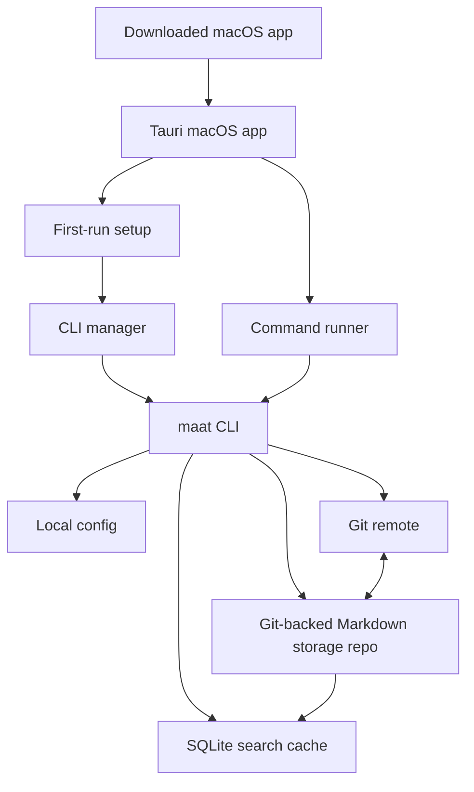
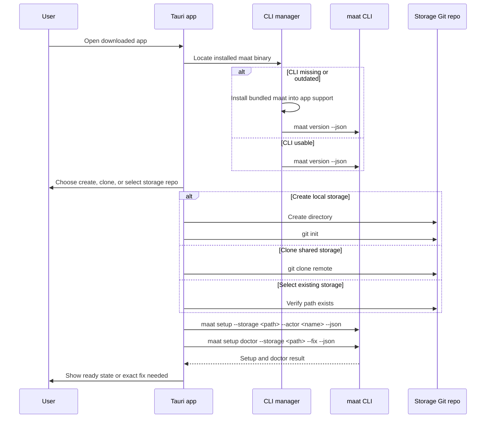
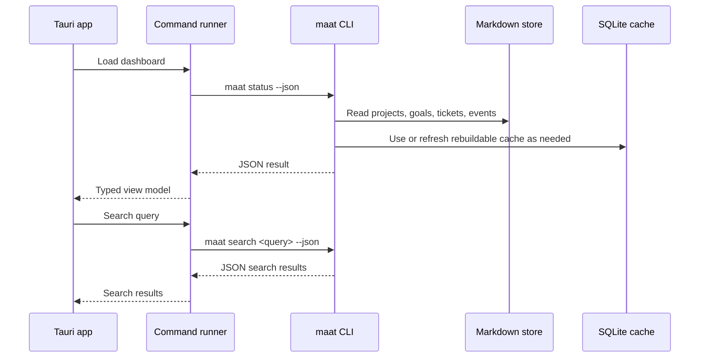
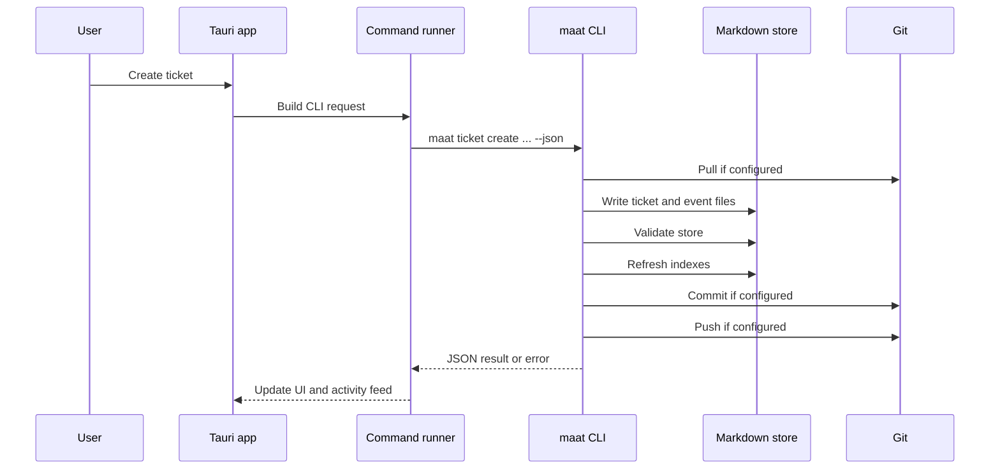
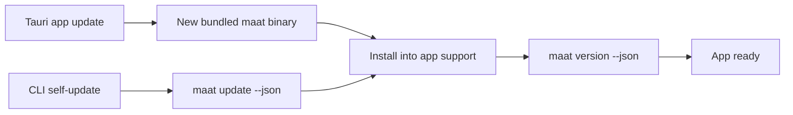

# macOS App Architecture

This document sketches a Tauri-based macOS app for Maat.

The app should be a desktop interface over the existing `maat` CLI. It should not
reimplement Maat storage, validation, indexing, syncing, or update behavior.
Markdown plus Git remains authoritative, SQLite remains a rebuildable cache, and
the CLI remains the product API.

## Goals

- Provide a first-run Mac setup flow for people who do not want to start in a
  terminal.
- Automatically install and configure the `maat` CLI during app setup.
- Use CLI JSON output for all reads and writes.
- Keep agent and human workflows compatible with terminal usage.
- Make the desktop app optional; installing it must not change the storage model.

## Non-Goals

- The app is not a hosted service.
- The app does not own project state.
- The app does not write Markdown directly.
- The app does not replace the terminal CLI or TUI.

## System Shape



## App Components

The desktop app should have thin components around the CLI:

| Component | Responsibility |
| --- | --- |
| Tauri shell | Native macOS window, menu bar actions, app lifecycle, and update surface. |
| Frontend UI | Projects, goals, tickets, search, activity, catalog, and setup screens. |
| Command runner | Spawns `maat` commands, captures stdout/stderr, parses JSON, maps errors to UI states. |
| CLI manager | Finds, installs, verifies, updates, and records the `maat` binary path. |
| Setup assistant | Creates or selects the storage Git repo, then runs `maat setup`. |
| Sync controller | Runs status, validate, sync, and index rebuild commands from user actions or background refreshes. |

## CLI Installation

The app should treat the CLI as a required dependency and install it during
first-run setup.

Preferred first version:

1. Bundle a signed `maat` binary inside the macOS app.
2. On first launch, run the bundled binary from the app bundle.
3. Use that bundled binary to run `maat update --source <bundled-binary>
   --install-dir <app-bin-dir> --json` when an app-private CLI is missing or
   older than the bundled version.
4. Record the installed path in the app settings.
5. Offer an optional "Install command line tool" action that symlinks or copies
   the same binary into a directory on `PATH`.

The internal app binary path should be private to the desktop app. A good default
is:

```text
~/Library/Application Support/maat/bin/maat
```

The terminal-facing install may still use the existing CLI default, such as:

```text
~/.local/bin/maat
```

This gives the app a reliable binary without forcing shell profile changes. It
also lets terminal users continue using the documented installer and `maat
update`.

## First-Run Setup Flow



The setup assistant should only perform conservative local actions by default:
create a local storage directory, initialize Git when the user chooses to create a
new repo, run setup, run doctor, and rebuild indexes. Adding remotes, pushing,
or enabling auto-push should require an explicit user choice.

## Runtime Read Flow



The UI should prefer existing parseable commands:

```sh
maat status --json
maat projects --json
maat project show <project-key> --json
maat ticket list --project <project-key> --json
maat ticket show <ticket-id> --project <project-key> --json
maat catalog list apps --project <project-key> --json
maat search <query> --json
maat validate --json
maat sync --status --json
```

## Runtime Write Flow



The command runner should use the same write commands agents already use:

```sh
maat goal create <project-key> <title> --outcome <text> --json
maat ticket create <project-key> <title> --description <text> --acceptance <text> --json
maat ticket claim <ticket-id> --project <project-key> --agent <actor> --ttl 2h --json
maat ticket comment <ticket-id> <comment> --project <project-key> --json
maat ticket complete <ticket-id> --project <project-key> --evidence <text> --json
maat sync --json
maat sync --push --json
```

## Error Handling

The command runner should preserve CLI errors instead of hiding them behind a
generic desktop message.

| CLI condition | App behavior |
| --- | --- |
| Missing CLI | Install bundled CLI, then retry `maat version --json`. |
| Missing setup | Open setup assistant. |
| Invalid storage path | Ask user to choose or create a storage repo. |
| Doctor warning | Show the specific check, whether it can be fixed, and the safe action. |
| Git needs credentials | Show the failed Git action and offer to retry after credentials are fixed. |
| Index failure after write | Keep the successful write visible and offer `maat index rebuild`. |
| Merge conflict | Stop writes, show storage repo path, and guide user to resolve via Git. |

## Update Model

The app and CLI can update independently, but the app should always know which
CLI it is using.



For the first release, the app should install the bundled CLI and check for app
updates as a single product update path. Later, an advanced settings screen can
allow the user to run `maat update --json` against GitHub Releases.

## Security And Signing

- Sign and notarize the macOS app.
- Sign the bundled `maat` binary as part of the app bundle.
- Verify the installed CLI by running `maat version --json` and checking the
  expected binary path.
- Do not ask for broad filesystem access until the user chooses a storage repo.
- Avoid storing credentials; Git should use the user's existing credential
  helpers, SSH agent, or system keychain.
- Treat the storage repo path as user-owned data, not app-private data.

## Implementation Sequence

1. Build a Tauri app shell with a command runner that can call a configured
   `maat` binary.
2. Add CLI manager support for bundled CLI install, version checks, and path
   recording.
3. Build first-run setup: create, clone, or select storage, then run `maat setup`
   and `maat setup doctor`.
4. Build read-only dashboard views using `status`, `projects`, `project show`,
   `ticket list`, `ticket show`, `catalog list`, and `search`.
5. Add write actions for goals, tickets, comments, claims, completion, validate,
   and sync.
6. Add background refresh and explicit sync controls.
7. Add optional terminal CLI installation into a PATH directory.

Detailed first-release slices:

- [Desktop Dashboard Views](./desktop-dashboard-views.md)
- [Desktop Write Actions](./desktop-write-actions.md)
- [Desktop Sync Controls](./desktop-sync-controls.md)
- [Desktop Error States](./desktop-error-states.md)
- [Desktop Update Behavior](./desktop-update-behavior.md)
- [Desktop Signing Permissions](./desktop-signing-permissions.md)
- [Desktop First Release Decisions](./desktop-first-release-decisions.md)

## Open Product Decisions

The first-release defaults are recorded in
[Desktop First Release Decisions](./desktop-first-release-decisions.md).
